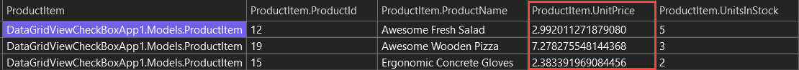

# About

Example for taking a decimal with more than two decimal places to two decimal places.




```json
[
  {
    "ProductId": 12,
    "ProductName": "Awesome Fresh Salad",
    "UnitPrice": "2.99",
    "UnitsInStock": 5
  },
  {
    "ProductId": 19,
    "ProductName": "Awesome Wooden Pizza",
    "UnitPrice": "7.28",
    "UnitsInStock": 3
  },
  {
    "ProductId": 15,
    "ProductName": "Ergonomic Concrete Gloves",
    "UnitPrice": "2.38",
    "UnitsInStock": 2
  }
]
```

Using the following converter from [Collin Mackay](https://colinmackay.scot/tag/system-text-json/)

```csharp
public class FixedDecimalJsonConverter : JsonConverter<decimal>
{
    public override decimal Read(ref Utf8JsonReader reader, Type typeToConvert, JsonSerializerOptions options)
    {
        string? stringValue = reader.GetString();
        return string.IsNullOrWhiteSpace(stringValue)
            ? default
            : decimal.Parse(stringValue, CultureInfo.InvariantCulture);
    }

    public override void Write(Utf8JsonWriter writer, decimal value, JsonSerializerOptions options)
    {
        string numberAsString = value.ToString("F2", CultureInfo.InvariantCulture);
        writer.WriteStringValue(numberAsString);
    }
}
```