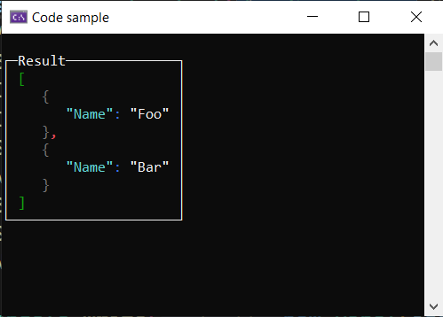

# About

Serialize list with properties using .NET System.Text.Json

https://stackoverflow.com/a/79310874/5509738

How can I let the JSON serializer ignore the enumeration of a class and serialize it as object and list its properties only?

https://dotnetfiddle.net/9rYP46

