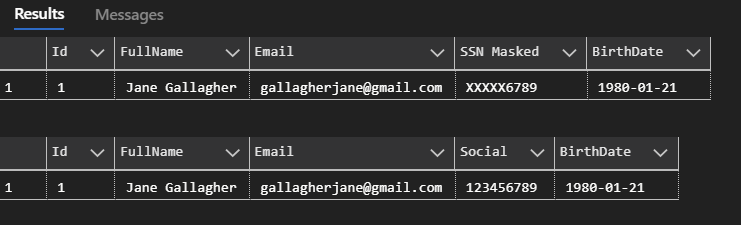

# About

An example for using `System.Text.Json`, `JsonConverter`. For demonstration purposes, serializing a list and de serializing a list. For SQL-Server, consider as stated below using dynamic data masking.

A Windows Forms project was used as in this project type its easier to view data and does not need to contend with what it takes to create MAUI, Blazor or ASP.NET Core and console project would be harder to view all data at once.

## Masking fo SQL-Server

Microsoft: [Dynamic data masking](https://learn.microsoft.com/en-us/sql/relational-databases/security/dynamic-data-masking?view=sql-server-ver16)

```sql
USE Demo;

CREATE TABLE dbo.Taxpayers
(
    Id INT IDENTITY PRIMARY KEY,
    FullName NVARCHAR(100) NOT NULL,
    Email NVARCHAR(100) NOT NULL,
    Social VARCHAR(9) MASKED WITH (FUNCTION = 'partial(0,"XXXXX",4)') NOT NULL,
    BirthDate DATE  NOT NULL
);

INSERT INTO dbo.Taxpayers(FullName,Email,Social,BirthDate) VALUES('Jane Gallagher', 'gallagherjane@gmail.com', '123456789', '1980-01-21');
-- Create a non-privileged user
CREATE USER NonPrivilegedUser WITHOUT LOGIN;
-- Grant SELECT permission
GRANT SELECT ON Taxpayers TO NonPrivilegedUser;
-- Impersonate the user to show initial masked view
EXECUTE AS USER = 'NonPrivilegedUser';
-- Query the data
SELECT Id,FullName,Email,Social AS "SSN Masked",BirthDate FROM dbo.Taxpayers;
-- Revert impersonation
REVERT;
-- Grant UNMASK permission
GRANT UNMASK TO NonPrivilegedUser;
-- Impersonate again to show unmasked view
EXECUTE AS USER = 'NonPrivilegedUser';
-- Query the data
SELECT Id,FullName,Email,Social,BirthDate FROM dbo.Taxpayers;
-- Revert impersonation
REVERT;
-- Remove the user
DROP USER NonPrivilegedUser;
-- Drop the table
DROP TABLE dbo.Taxpayers;
```

