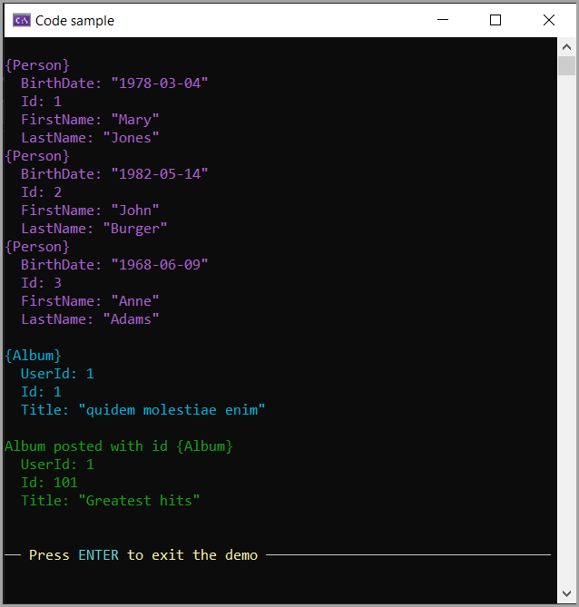

# About

This code sample highlights the use of

- HttpClientJsonExtensions.[GetFromJsonAsync](https://learn.microsoft.com/en-us/dotnet/api/system.net.http.json.httpclientjsonextensions.getfromjsonasync?view=net-8.0) Method
- HttpClientJsonExtensions.[PostAsJsonAsync](https://learn.microsoft.com/en-us/dotnet/api/system.net.http.json.httpclientjsonextensions.postasjsonasync?view=net-8.0) Method

Note that each of the methods above support [CancellationToken](https://learn.microsoft.com/en-us/dotnet/api/system.threading.cancellationtoken?view=net-6.0).

There are three methods

1. Read a list from a GitHub repository
1. Using data from the following [site](https://jsonplaceholder.typicode.com/)
    1. Read a single item
    1. Post data which returns the new id but is a fake post.

## Screen shot

In the actual code, [ObjectDumper.NET](https://www.nuget.org/packages/ObjectDumper.NET/4.1.15?_src=template) NuGet package is used to display results which when displayed goes past full screen so the follow was used.

In the first read for `Person` model the property `BirthDate` is defined as a string and has since been changed to `DateOnly`.

