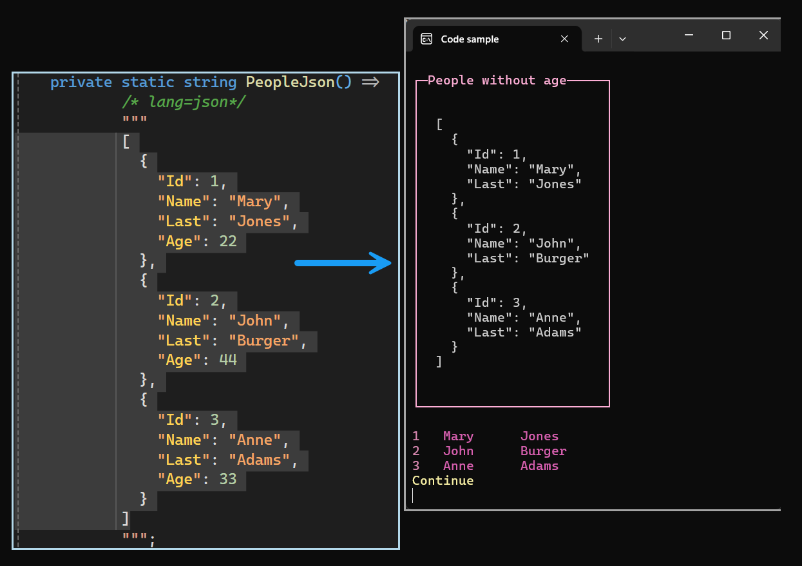

# About

cGiven a task to import json data that does not match the model, the following shows one method to import data that ignores one property and aliases two columns.

## Results

- New json structure
- Above matches our model

