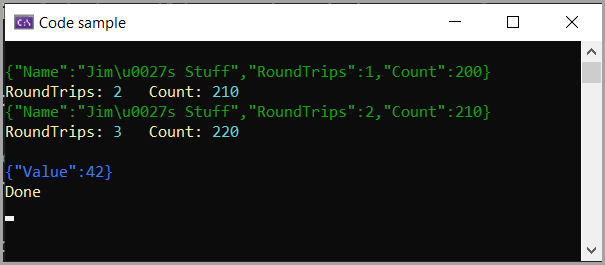

# About

Code sample start off for WithAddedModifier which lead to setting properties on deserialization.

Base code from Microsoft.

- [WithAddedModifier](https://learn.microsoft.com/en-us/dotnet/core/whats-new/dotnet-8/runtime) extension method
- Example: [Increment a property's value](https://learn.microsoft.com/en-us/dotnet/standard/serialization/system-text-json/custom-contracts#example-increment-a-propertys-value)
